<div align="center">
  
</div>

<div align="center">
  <br>
  <a href="mailto:aadityamehetre@icloud.com">
    
  </a>
  <a href="https://linkedin.com/in/aaditya-mehetre" target="_blank">
    
  </a>
  <a href="https://github.com/Harbringe/Harbringe/issues">
    
  </a>
</div>

<br>

<h2><samp>$ pip list | grep -iE "genai|vision"</samp></h2>

```text
langchain          rag pipelines · tool-calling agents · auditable orchestration
azure-openai       vision document extraction · confidence-routed human review
huggingface        transformers · model zoo
yolo               v11 · yolo-world · open-vocabulary detection
clip / blip-2      embeddings · captioning (yes, satellite imagery counts)
crnn / cnn         custom OCR — incl. a script that had no dataset until I made one
qdrant / chroma    vector stores doing real retrieval work
celery             async ml pipelines that survive mondays
```

<br>

<h2><samp>$ ls ~/toolbox</samp></h2>

<div align="center">
  
  <br>
  
</div>

<br>

<h2><samp>$ ./play snake --food=contributions</samp></h2>

<div align="center">
  <picture>
    <source media="(prefers-color-scheme: dark)" srcset="https://raw.githubusercontent.com/Harbringe/Harbringe/output/github-contribution-grid-snake-dark.svg" />
    
  </picture>
</div>

<br>

<h2><samp>$ btop --user harbringe</samp></h2>

<div align="center">
  
</div>

<br>

<h2><samp>$ crontab -l</samp></h2>

```bash
# m   h    dom  mon  dow    command
  0   9    *    *    *      ./train_models.sh          # ☕ mornings are for ML
  0   14   *    *    *      ./ship_backends.sh         # 🚀 afternoons ship APIs
  0   23   *    *    *      git commit -m "one more"   # 🌙 every single night
```

<br>

<div align="center">
  <samp>$ shutdown -h now &nbsp;&nbsp;# just kidding — ★ something before you go</samp>
  <br><br>
  
</div>

<!--
        ▀▄   ▄▀
       ▄█▀███▀█▄        you read the source. of course you did.
      █▀███████▀█       curiosity level: dangerous. we should talk →
      █ █▀▀▀▀▀█ █       aadityamehetre@icloud.com
       ▀▀ ▀▀▀ ▀▀
-->
